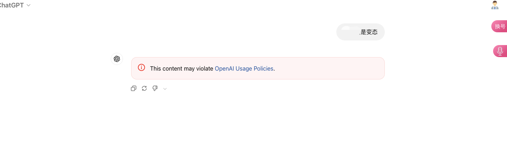

# 审计限流

审计限流服务为开源项目,用于对用户的输入进行合规审核并对用户请求频率进行限制。

仓库地址 [https://github.com/xyhelper/auditlimit](https://github.com/xyhelper/auditlimit)

## 安装配置

默认部署时已经集成了限流服务,可以在`docker-compose.yml`中查看更改相关配置

```yaml
services:
  auditlimit:
    image: xyhelper/auditlimit
    restart: always
    environment:
      # 可选:内容审核所用的 OpenAI key,不填则只做限流
      # OAIKEY: "sk-xxxxx"
      DEFAULT: "20/3h" # 兜底限流:未单独配置的模型都用这一项
      GPT-5-6: "60/3h" # 模型 gpt-5-6:每 3 小时最多 60 次
```

部署包里已经按 Pro / Thinking / 标准 / 工作模式等分好了档,完整列表见
`docker-compose.yml` 中 `auditlimit` 的 `environment`。

> **提示：OAI审计接口介绍**
> OAI提供了免费的审计接口,调用不计费,但建议使用 tier 1 或更高级别的apikey,以免因限速导致调用审计失败。
>
> 当前审计限流服务在调用审计接口失败后会直接放行请求。

## 限流规则

限流的统计维度是**调用方 token + 模型**,调用方 token 取自请求头 `Authorization`
(去掉 `Bearer ` 前缀)。

### 配置键

模型名由上游接口返回,大小写不统一且部分含 `.`,转成配置键的规则固定为两步:

1. 转为**全大写**
2. 把 `.` 替换为 `_`

| 模型名 | 配置键 |
| --- | --- |
| `gpt-5-6` | `GPT-5-6` |
| `gpt-5-6-t-mini` | `GPT-5-6-T-MINI` |
| `gpt-5.6-sol-wm` | `GPT-5_6-SOL-WM` |
| `research` / `agent` | `RESEARCH` / `AGENT` |

必须把 `.` 写成 `_` 的原因有两个:配置框架把 `.` 当作键的路径分隔符,写
`GPT-5.6-SOL-WM` 会被解析成「`GPT-5` 下面的 `6-SOL-WM`」而永远读不到值;`.` 也不是
合法的环境变量名字符,在 shell 里无法直接书写。

### 值的格式

限流值统一为 `次数/时间`,例如 `60/3h` 表示每 3 小时最多 60 次。

- 次数必须是正整数
- 时间沿用 Go duration 写法,单位为 `s` / `m` / `h`,也可组合,如 `90m`、`1h30m`
- 值必须恰好包含一段 `/`,格式非法时回退到内置兜底值 `40/3h`
- YAML 中建议始终加引号,避免被解析成别的类型

`RESEARCH` / `AGENT` 的特别之处在于:当请求体的 `system_hints` 中出现 `research` /
`agent` 时,模型名会被强制替换,从而命中这两个键。`AUTO` 对应模型选择器中的「Auto」档
(请求带 `model=auto`)。它们都是**普通模型键**,删掉并不会让对应模型不受限制,而是回落
到 `DEFAULT`。

真正的特殊键只有 `DEFAULT`(兜底值)、`PORT`(监听端口,默认 `8080`)、`OAIKEY`(内容
审核 key,留空则不启用审核)与 `MODERATION`(moderations 接口地址,默认使用内置网关)。

### 禁用某个模型

把某个模型的值写成 `DISABLED`(不区分大小写)即可禁止用户使用该模型:

```yaml
GPT-5_5-WM: "DISABLED"
```

- 命中的请求返回 **403**,响应体为 `{"detail":{"code":"model_disabled","message":"..."}}`
- 禁用判断在内容审核与限流之前完成,被禁用的模型不消耗额度,也不会触发 moderation
  调用
- 未单独配置的模型会落到 `DEFAULT`,把 `DEFAULT` 写成 `DISABLED` 即可禁用所有未单独配置
  的模型。但 `AUTO`、`RESEARCH`、`AGENT` 也会因回退到 `DEFAULT` 而被一并禁用,若只想禁
  用未知模型,需要把这三项显式写成合法限流值
- `RESEARCH` / `AGENT` 一般不要设为 `DISABLED`,否则研究 / 代理模式会整体不可用

### 禁止词

在宿主机的 `data/auditlimit/keywords.txt` 中每行写一个词(该目录已挂载到容器的
`/app/data/`),提问内容命中后返回 **400**:

```json
{ "detail": "请珍惜账号,不要提问违禁内容." }
```

## 返回格式

正常通过时返回状态码 200,响应体为空。

额度耗尽时返回 **429**:

```json
{
  "detail": {
    "clears_in": 252,
    "code": "model_cap_exceeded",
    "message": "You have triggered the usage frequency limit of gpt-5.6, the current limit is 60 times/3h0m0s, please wait 252 seconds before trying again."
  }
}
```

`clears_in` 为预计需要等待的秒数,`detail` 是**对象而不是字符串**,客户端请读
`detail.code` 与 `detail.clears_in`。429 的 `code` 为 `model_cap_exceeded`,与禁用的
`model_disabled`、内容审核未通过的 `flagged_by_moderation` 区分开,便于客户端提示用户
「稍后重试」还是「更换模型」。

审计效果如下:


